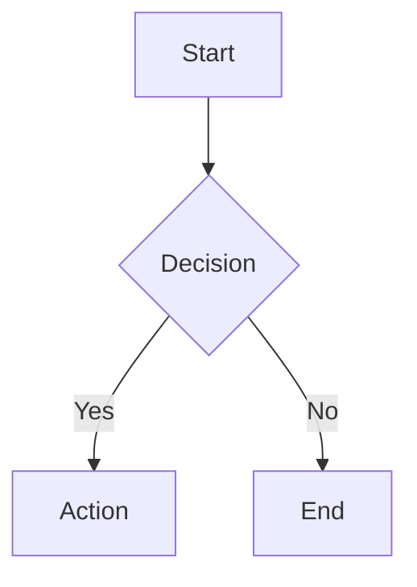

# Obsidian Markdown Reference

Quick reference for Obsidian-flavoured markdown syntax. Use this when writing notes to ensure they render correctly in Obsidian and feel native to the vault. Based on Obsidian's official documentation.

## Internal Links (Wikilinks)

Obsidian uses `[[wikilinks]]` by default. This vault has wikilinks enabled.

### Basic Links

```markdown
[[Note Name]]                        → links to Note Name.md
[[Note Name|Display Text]]           → shows "Display Text", links to Note Name.md
[[Note Name#Heading]]                → links to a specific heading
[[Note Name#Heading|Display Text]]   → heading link with custom display text
[[#Heading]]                         → links to heading in the same note
```

### Block References

```markdown
[[Note Name#^block-id]]              → links to a specific block (paragraph/list item)
```

Block references are Obsidian-specific and won't work in other markdown editors.

### Embedding (Transclusion)

Prefix any internal link with `!` to embed the content inline:

```markdown
![[Note Name]]                       → embeds the entire note
![[Note Name#Heading]]               → embeds content under that heading
![[Note Name#^block-id]]             → embeds a specific block
![[image.png]]                       → embeds an image
![[document.pdf]]                    → embeds a PDF viewer
```

### Link Rules for This Vault

- **Always use the filename**, not the `title` frontmatter property.
- Non-markdown files need extensions: `[[Figure 1.png]]`, `[[report.pdf]]`.
- Avoid these characters in filenames: `# | ^ : %% [[ ]]`.
- Verify links exist before including them — a broken link creates a phantom empty note.

## Basic Formatting

```markdown
**bold**                             → bold
*italic*                             → italic
==highlighted text==                 → highlighted (Obsidian-specific)
~~strikethrough~~                    → strikethrough
`inline code`                        → inline code
> blockquote                         → blockquote
---                                  → horizontal rule
```

## Headings

```markdown
# Heading 1
## Heading 2
### Heading 3
#### Heading 4
##### Heading 5
###### Heading 6
```

Headings become anchor points for linking: `[[Note#Heading 2]]`.

## Lists

```markdown
- Unordered item                     → bullet list
  - Nested item                      → indented with 2 spaces
1. Ordered item                      → numbered list
- [ ] Task item                      → unchecked task
- [x] Completed task                 → checked task
```

## Code Blocks

````markdown
```python
import pandas as pd
df = pd.read_csv("data.csv")
```
````

Always include the language identifier for syntax highlighting.

## Tables

```markdown
| Column 1 | Column 2 | Column 3 |
|----------|----------|----------|
| Cell 1   | Cell 2   | Cell 3   |
| Cell 4   | Cell 5   | Cell 6   |
```

Alignment: `|:---|` left, `|:---:|` centre, `|---:|` right.

## Tags

```markdown
#tag-name                            → inline tag
```

Tags in frontmatter (preferred for this vault):
```yaml
tags:
  - tag-one
  - tag-two
```

Tags are case-insensitive. Nested tags use `/`: `#research/transplant`.

## Footnotes

```markdown
This has a footnote[^1].

[^1]: This is the footnote content.
```

## Math (LaTeX)

```markdown
Inline: $E = mc^2$
Block:
$$
\int_0^\infty e^{-x} dx = 1
$$
```

## Comments

```markdown
%%This is a comment and won't render in preview%%
```

Useful for notes-to-self that shouldn't appear in reading view.

## Mermaid Diagrams

````markdown

````

Obsidian renders Mermaid natively. Supports flowcharts, sequence diagrams, Gantt charts, class diagrams, and more.

---

## Callouts

Callouts are styled blockquotes for highlighting information. Syntax:

```markdown
> [!type] Optional Title
> Content of the callout.
> Supports **markdown**, [[wikilinks]], and embeds.
```

If no title is given, the type name is used as the title (capitalised).

### Foldable Callouts

```markdown
> [!type]+ Expanded by default
> This content is visible.

> [!type]- Collapsed by default
> This content is hidden until clicked.
```

### Nesting

```markdown
> [!question] Outer callout
> > [!tip] Nested callout
> > Content here.
```

### Supported Callout Types

**Informational (blue):**
- `[!note]` — general notes
- `[!info]` — informational, aliases: `[!todo]`
- `[!abstract]` — summaries, aliases: `[!summary]`, `[!tldr]`

**Positive (green):**
- `[!tip]` — tips and hints, aliases: `[!hint]`, `[!important]`
- `[!success]` — success/completed, aliases: `[!check]`, `[!done]`
- `[!question]` — questions/FAQ, aliases: `[!help]`, `[!faq]`

**Warning (orange/yellow):**
- `[!warning]` — warnings, aliases: `[!caution]`, `[!attention]`
- `[!example]` — examples

**Negative (red):**
- `[!failure]` — failure, aliases: `[!fail]`, `[!missing]`
- `[!danger]` — danger, alias: `[!error]`
- `[!bug]` — bugs

**Neutral:**
- `[!quote]` — quotes, alias: `[!cite]`

### Callout Best Practices for This Vault

Use callouts sparingly — one or two per note. The vault uses these patterns:

```markdown
> [!tip] Key Insight
> The single most important takeaway from this note.

> [!success] Decisions Made
> - Decision with rationale
> - Decision with rationale

> [!question] To Investigate
> - Question framed as a question
> - Why this matters

> [!warning] Contradiction
> This source disagrees with [[Other Note]] on [topic]. Needs review.
```

Don't use callouts as a formatting crutch — if the content isn't special, use regular prose.

---

## Frontmatter (YAML)

Frontmatter goes at the very top of the file, between `---` fences:

```yaml
---
created: 2026-04-06
date: 2026-04-06
status: active
description: "One-sentence summary"
tags:
  - claude
  - topic
author: "Author Name"
source: "https://example.com"
aliases:
  - "Alternative Name"
---
```

See VAULT-OPS.md for the full property schema and conventions.

---

## Properties (Obsidian-Specific)

Since Obsidian v1.4, frontmatter properties have a dedicated UI. Key behaviours:

- **`aliases`** — list of alternative names for link resolution. When you search for a link, aliases appear as suggestions.
- **`tags`** — same as inline `#tags` but cleaner. Prefer frontmatter tags.
- **`cssclasses`** — applies CSS classes to the note for custom styling.
- Properties are **case-sensitive** in some contexts (Dataview, Bases). This vault uses all lowercase.

---

## What NOT to Use

Some markdown features don't work well in Obsidian or aren't used in this vault:

- **HTML tags** — work in Obsidian but break portability. Avoid unless necessary.
- **`title` property** — this vault uses filename as title. Don't add `title` to frontmatter.
- **Standard markdown links** `[text](url)` for internal links — use wikilinks `[[text]]` instead. Standard links don't generate backlinks or show in graph view.
- **Deeply nested headings** (H5, H6) — rarely useful. Stick to H1–H3 for most notes, H4 occasionally.
